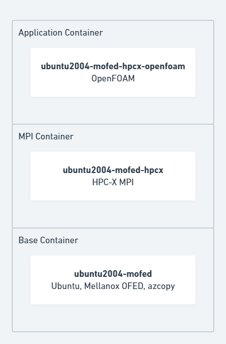
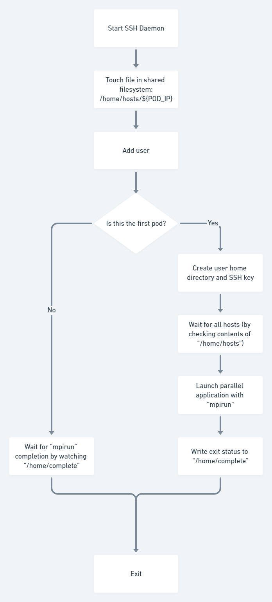

# HPC on Azure Kubernetes Service

## Pre-requisites

This installation assumes you have the following setup:

* Docker installed to build the containers
* AKS cluster with Infiniband feature flag enabled

  To enable the feature run:
  ```
  az feature register --name AKSInfinibandSupport --namespace Microsoft.ContainerService
  ```

  Check the status with the following:
  ```
  az feature list -o table --query "[?contains(name, 'Microsoft.ContainerService/AKSInfinibandSupport')].{Name:name,State:properties.state}"
  ```

  Register when ready:

  ```
  az provider register --namespace Microsoft.ContainerService
  ```

## Deploy

All the instructions here will be using environment variables for the parameters.  Below are the environment variables that have been used to test using WSL2 - you may need to set up ssh keys if you do not have them already.

```
resource_group=hpc-on-aks-demo
aks_admin_user=$USER
aks_public_key="$(</home/$USER/.ssh/id_rsa.pub)"
```

First create a resource group to deploy in to:

```
az group create --location westeurope --name $resource_group
```

Next, deploy the `azureDeploy.bicep` template.  This is using my current user with the my ssh key in `.ssh`:

```
az deployment group create \
    --resource-group $resource_group \
    --template-file azureDeploy.bicep \
    --parameters \
        aksAdminUsername=$aks_admin_user \
        aksPublicKey="$aks_public_key" \
    | tee deploy-output.json
```

> Note: the output is also written to `deploy-output.json` which is used in later code snippets to get resource names.

First we will need the AKS cluster name.  This is an output from the deployment but it is also available from the portal.

```
aks_cluster_name=$(jq -r .properties.outputs.aksClusterName.value deploy-output.json)
```

> Note: if you do not have `jq` installed you can just look in the json output from the deployment.

Now to set up the credentials for `kubectl`:

```
az aks get-credentials --overwrite-existing --resource-group $resource_group --name $aks_cluster_name
```

## Installing the Mellanox driver on the host

These steps require the ACR name.  This is in the output from the deployment:

```
export acr_name=$(jq -r .properties.outputs.acrName.value deploy-output.json)
```

Note: `acr_name` is exported so that it can be used by `render_template.py` later.

Log in to the ACR using the Azure CLI:

```
az acr login -n $acr_name
```

The host image provided by AKS does not contain the Mellanox driver at the time of writing.  However, the AKS team have a GitHub project, [aks-rdma-infiniband](https://github.com/Azure/aks-rdma-infiniband), to enable this through a daemonset.  Full details can be seen in the GitHub project but the steps are outline below.

> Note: these steps require Docker to build the container.

Pull the repo from GitHub:

```
git clone https://github.com/Azure/aks-rdma-infiniband.git
```

Build and push the container:
```
cd aks-rdma-infiniband
docker build -t ${acr_name}.azurecr.io/mlnx-driver-install .
docker push ${acr_name}.azurecr.io/mlnx-driver-install
```

Update the container name and deploy the daemonset:
```
sed -i "s/<insert image name here>/${acr_name}.azurecr.io\/mlnx-driver-install:latest/g" shared-hca-images/driver-installation.yml
kubectl apply -k shared-hca-images/.
```

To check the installation:
```
kubectl get pods
kubectl logs <name of installation pod>
```
## Containers

The containers have created based on the scripting from [azhpc-images](https://github.com/Azure/azhpc-images) GitHub repo.  However, it has been separated into the following hierarchy:
* __Base container__: Contains the OS, Mellanox OFED driver and general tools.
* __MPI container__: Adding an MPI version to the base container.
* __Application container__: New container created for each application. 

The Azure images for VMs contain all the different MPIs doing this significantly increases the size which is particularly noticeable for containers.



### Building the containers

#### Ubuntu 20.04 container with Mellanox OFED - ubuntu2004-mofed
```
pushd ubuntu2004-mofed-docker
docker build -t ${acr_name}.azurecr.io/ubuntu2004-mofed .
docker push ${acr_name}.azurecr.io/ubuntu2004-mofed
popd
```

#### HPCX MPI layer on top of the previous container image - ubuntu2004-mofed-hpcx
```
pushd ubuntu2004-mofed-hpcx-docker
sed "s/__ACRNAME__/${acr_name}/g" Dockerfile.template > Dockerfile
docker build -t ${acr_name}.azurecr.io/ubuntu2004-mofed-hpcx .
docker push ${acr_name}.azurecr.io/ubuntu2004-mofed-hpcx
popd
```

#### OpenFoam v10 container - ubuntu2004-mofed-hpcx-openfoam
```
pushd ubuntu2004-mofed-hpcx-openfoam-docker
sed "s/__ACRNAME__/${acr_name}/g" Dockerfile.template > Dockerfile
docker build -t ${acr_name}.azurecr.io/ubuntu2004-mofed-hpcx-openfoam .
docker push ${acr_name}.azurecr.io/ubuntu2004-mofed-hpcx-openfoam
popd
```
## Running some tests

This is the workflow that starts an MPI job.



### Testing the IB with IMB-MPI1 PingPong

The example `pingpong-mpi-job.yaml.template` is an example running the IMB-MPI1 PingPong test.  It is parameterized on ACR name and the number of nodes to use.  Create the YAML as follows:

```
sed "s/__ACRNAME__/${acr_name}/g;s/__NNODES__/2/g" pingpong-mpi-job.yaml.template > pingpong-mpi-job.yaml
```

This example uses an `indexed-job` to run the MPI test.  All the initialization and start-up is embedded in the command.  The pods will all terminate once the job is complete although the storage remains.  The `index` is used to find the first pod and this will create the home directory, ssh keys, hostfile and launch `mpirun`.  Here is an overview of steps:

* Start SSH daemon
* Touch file `/home/hosts/<IP-ADDRESS>`
* Add user and group
* If index == 0:
  - Create home directory
  - Create SSH key and set SSH config and authorized_keys
  - Wait for all hosts to start by checking the number of files in /home/hosts
  - Create a hostfile from the filenames in /home/hosts
  - Launch `mpirun` command
  - Get exit status and create file `/home/complete` with either success or failure
* Else index > 0:
  - Wait for file `/home/complete` to be created
* Exit pod

Deploy with:

```
kubectl apply -f pingpong-mpi-job.yaml
```

The mpirun output will be in the first pod.  You can find this with:

```
kubectl get pods
```

And, then look at the `indexed-job-0-XXXXX`:

```
kubectl logs indexed-job-0-XXXXX
```

This is example output:

```
[      0 ] Starting SSH daemon
 * Starting OpenBSD Secure Shell server sshd
   ...done.
[      0 ] Creating IP file (/home/hosts/10.244.28.5)
[      0 ] Adding user with homedir (hpcuser)
Adding group `hpcuser' (GID 1000) ...
Done.
Adding user `hpcuser' ...
Adding new user `hpcuser' (1000) with group `hpcuser' ...
Creating home directory `/home/hpcuser' ...
Copying files from `/etc/skel' ...
[      0 ] User added ()
[      0 ] Creating ssh key
[      1 ] Waiting for hosts
[      1 ] - hosts available: 1 out of 2
[     11 ] - hosts available: 1 out of 2
[     21 ] Creating hostfile
[     21 ] Hostfile contents:
10.244.28.5
10.244.29.5
[     21 ] Launching MPI
Loading mpi/hpcx
  Loading requirement:
    /opt/hpcx-v2.11-gcc-MLNX_OFED_LINUX-5-ubuntu20.04-cuda11-gdrcopy2-nccl2.11-x86_64/modulefiles/hpcx
Warning: Permanently added '10.244.29.5' (ECDSA) to the list of known hosts.
[indexed-job-0:00092] MCW rank 0 bound to socket 0[core 0[hwt 0]]: [B/././././././././././././././././././././././././././././././././././././././././././././././././././././././././././.][./././././././././././././././././././././././././././././././././././././././././././././././././././././././././././.]
[indexed-job-1:00062] MCW rank 1 bound to socket 0[core 0[hwt 0]]: [B/././././././././././././././././././././././././././././././././././././././././././././././././././././././././././.][./././././././././././././././././././././././././././././././././././././././././././././././././././././././././././.]
#------------------------------------------------------------
#    Intel (R) MPI Benchmarks 2018, MPI-1 part
#------------------------------------------------------------
# Date                  : Fri Sep 16 15:20:51 2022
# Machine               : x86_64
# System                : Linux
# Release               : 5.4.0-1089-azure
# Version               : #94~18.04.1-Ubuntu SMP Fri Aug 5 12:34:50 UTC 2022
# MPI Version           : 3.1
# MPI Thread Environment:


# Calling sequence was:

# /opt/hpcx-v2.11-gcc-MLNX_OFED_LINUX-5-ubuntu20.04-cuda11-gdrcopy2-nccl2.11-x86_64/ompi/tests/imb/IMB-MPI1 PingPong  

# Minimum message length in bytes:   0
# Maximum message length in bytes:   4194304
#
# MPI_Datatype                   :   MPI_BYTE
# MPI_Datatype for reductions    :   MPI_FLOAT
# MPI_Op                         :   MPI_SUM
#
#

# List of Benchmarks to run:

# PingPong

#---------------------------------------------------
# Benchmarking PingPong
# #processes = 2
#---------------------------------------------------
       #bytes #repetitions      t[usec]   Mbytes/sec
            0         1000         1.79         0.00
            1         1000         1.78         0.56
            2         1000         1.78         1.13
            4         1000         1.79         2.24
            8         1000         1.78         4.49
           16         1000         1.79         8.96
           32         1000         1.93        16.62
           64         1000         2.07        30.97
          128         1000         2.08        61.43
          256         1000         2.66        96.08
          512         1000         2.82       181.39
         1024         1000         2.91       351.81
         2048         1000         3.13       654.76
         4096         1000         3.71      1103.37
         8192         1000         4.31      1900.06
        16384         1000         5.60      2923.27
        32768         1000         7.75      4230.65
        65536          640        10.91      6004.71
       131072          320        17.11      7662.75
       262144          160        19.86     13202.82
       524288           80        32.01     16380.15
      1048576           40        55.18     19003.71
      2097152           20       103.34     20293.98
      4194304           10       198.12     21170.38


# All processes entering MPI_Finalize

[     22 ] Writing completion file (/home/complete)
[     22 ] Exiting, status: success)
```

### Testing the MPI layer

In this example we will deploy the OpenFoam container on two pods. Each pod will run on a single host. To run MPI worklouds we will need to optain the IP addesses of the two pods once the yare running. 

* TODO: Get IP addresses for hostfile

```
kubectl 
```
We start deployeing the pods:
```
sed "s/__ACRNAME__/${acr_name}/g" test-openfoam.yaml.template > test-openfoam.yaml
kubectl apply -f test-openfoam.yaml
```
We can check the status of the pods:

```
kubectl get pods 
```
After the pods are up we can chekc for the internal IP address:
```
kubectl get pods of-mpi-pod1 of-mpi-pod2 -o custom-columns=NAME:.metadata.name,PodIP:status.podIP
NAME          PodIP
of-mpi-pod1   10.244.2.7
of-mpi-pod2   10.244.3.6
```
Now we can connect to the first pod and switch to the hpcuser:
```
kubectl exec -it mpi-pod1 -- bash
sudo su - hpcuser
```
To simplify launching mpi worklouds we can store the IP addresses in a hostfile.

```
cat ~/hostfile

10.244.2.7
10.244.3.6
```
We load the HPC-X MPI environemnt module.
```
module load mpi/hpcx
```
Then we run a simple IMB-MPI1 PingPong test:

look it works :-)

```
hpcuser@mpi-pod1:~$ mpirun -np 2 -npernode 1 -hostfile ~/hostfile -x LD_LIBRARY_PATH -x UCX_TLS=rc -report-bindings /opt/hpcx-v2.11-gcc-MLNX_OFED_LINUX-5-ubuntu20.04-cuda11-gdrcopy2-nccl2.11-x86_64/ompi/tests/imb/IMB-MPI1 PingPong 
[mpi-pod1:00232] MCW rank 0 bound to socket 0[core 0[hwt 0]]: [B/././././././././././././././././././././././././././././././././././././././././././././././././././././././././././.][./././././././././././././././././././././././././././././././././././././././././././././././././././././././././././.]
[mpi-pod2:00170] MCW rank 1 bound to socket 0[core 0[hwt 0]]: [B/././././././././././././././././././././././././././././././././././././././././././././././././././././././././././.][./././././././././././././././././././././././././././././././././././././././././././././././././././././././././././.]
#------------------------------------------------------------
#    Intel (R) MPI Benchmarks 2018, MPI-1 part
#------------------------------------------------------------
# Date                  : Fri Sep  9 16:54:32 2022
# Machine               : x86_64
# System                : Linux
# Release               : 5.4.0-1089-azure
# Version               : #94~18.04.1-Ubuntu SMP Fri Aug 5 12:34:50 UTC 2022
# MPI Version           : 3.1
# MPI Thread Environment:


# Calling sequence was:

# /opt/hpcx-v2.11-gcc-MLNX_OFED_LINUX-5-ubuntu20.04-cuda11-gdrcopy2-nccl2.11-x86_64/ompi/tests/imb/IMB-MPI1 PingPong

# Minimum message length in bytes:   0
# Maximum message length in bytes:   4194304
#
# MPI_Datatype                   :   MPI_BYTE
# MPI_Datatype for reductions    :   MPI_FLOAT
# MPI_Op                         :   MPI_SUM
#
#

# List of Benchmarks to run:

# PingPong

#---------------------------------------------------
# Benchmarking PingPong
# #processes = 2
#---------------------------------------------------
       #bytes #repetitions      t[usec]   Mbytes/sec
            0         1000         1.69         0.00
            1         1000         1.69         0.59
            2         1000         1.68         1.19
            4         1000         1.74         2.30
            8         1000         1.69         4.73
           16         1000         1.70         9.43
           32         1000         1.89        16.94
           64         1000         1.97        32.49
          128         1000         2.02        63.29
          256         1000         2.61        97.97
          512         1000         2.75       185.89
         1024         1000         2.78       368.82
         2048         1000         3.06       670.01
         4096         1000         3.74      1095.95
         8192         1000         4.25      1926.70
        16384         1000         5.53      2962.20
        32768         1000         7.56      4334.91
        65536          640        10.82      6057.67
       131072          320        16.79      7805.51
       262144          160        19.38     13529.41
       524288           80        30.17     17375.04
      1048576           40        52.75     19878.20
      2097152           20        97.51     21506.12
      4194304           10       183.81     22818.79


# All processes entering MPI_Finalize

hpcuser@mpi-pod1:~$
```
## Add a local ssd or nvme drive(s) as local scratch

This implementation is based on the aks-nvme-ssd-provisioner from Alessando Vozza (https://github.com/ams0/aks-nvme-ssd-provisioner).

We modify the menifests to not need to you a persistant volume claim for each compute node and to mount the disk or raidset under /pv-disks/scratch on the host whcih makes it easier to use with teh kubernetes indexed jobs. 

First we clone the repository and enter the directory:
```
git clone https://github.com/ams0/aks-nvme-ssd-provisioner
pushd aks-nvme-ssd-provisioner
```
Then we change the mountpoint and create the docker container and upload it into our container registry:
```
sed -i "s/\/pv-disks\/\$UUID/\/pv-disks\/scratch/g" aks-nvme-ssd-provisioner.sh
docker build -t ${acr_name}.azurecr.io/aks-nvme-ssd-provisioner:v1.0.2 .
docker push ${acr_name}.azurecr.io/aks-nvme-ssd-provisioner:v1.0.2
```
The next step conisists in modifying container registry in the manifest and change the name of the label:
```
sed -i "s/ams0/${acr_name}.azurecr.io/g" ./manifests/storage-local-static-provisioner.yaml
sed -i "s/kubernetes.azure.com\/aks-local-ssd/aks-local-ssd/g" ./manifests/storage-local-static-provisioner.yaml
```
Now we are ready to deploy the manifest and leave the directory:
```
kubectl apply -f manifests/storage-local-static-provisioner.yaml
popd
```
The manifest creates the following kubernetes resources:

*	clusterrolebinding.rbac.authorization.k8s.io/local-storage-provisioner-pv-binding
*	clusterrole.rbac.authorization.k8s.io/local-storage-provisioner-node-clusterrole
*	clusterrolebinding.rbac.authorization.k8s.io/local-storage-provisioner-node-binding
*	serviceaccount/local-storage-admin
*	configmap/local-provisioner-config
*	daemonset.apps/local-volume-provisioner
*	storageclass.storage.k8s.io/local-storage

To apply the changes to the nodepool hb120v2, we need to run the folowing command to add the label aks-local-ssd:
```
az aks nodepool update -g ${resource_group} --cluster-name ${acr_name} -n hb120v2 --labels aks-local-ssd=true
```


## Run the OpenFoam Helm demo

We assume 


We assume that we have already logged into the first pod and have populated the hostfile.
Let's download the openfoam_demo.sh script to the node:
```
wget https://raw.githubusercontent.com/edwardsp/hpc-on-aks/main/scripts/openfoam_demo.sh

Saving to: 'openfoam_demo.sh'

openfoam_demo.sh              100%[=================================================>]   1.24K  --.-KB/s    in 0s

2022-09-14 10:22:23 (47.9 MB/s) - 'openfoam_demo.sh' saved [1271/1271]
```

Then make it executable and run the script:
```
chmod u+x ./openfoam_demos.sh
./openfoam_demos.sh
```
You can track the progress using:
```
tail -f ./motorbike_scaled/of_output.txt

Running surfaceFeatures on /home/hpcuser/motorbike_scaled
Running blockMesh on /home/hpcuser/motorbike_scaled
Running decomposePar on /home/hpcuser/motorbike_scaled
...
```


# Notes

Get k8s resources:
```
kubectl api-resources
```
> Useful to find a new type, e.g. volcano job

